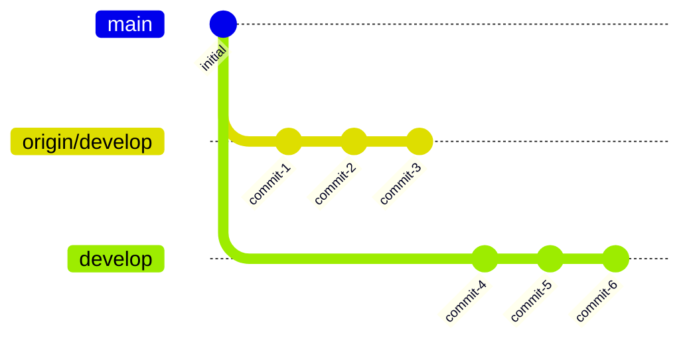
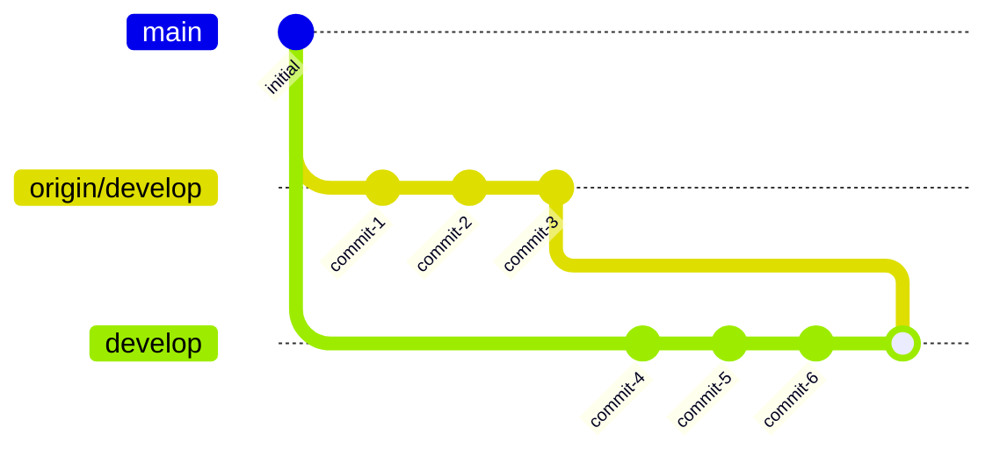
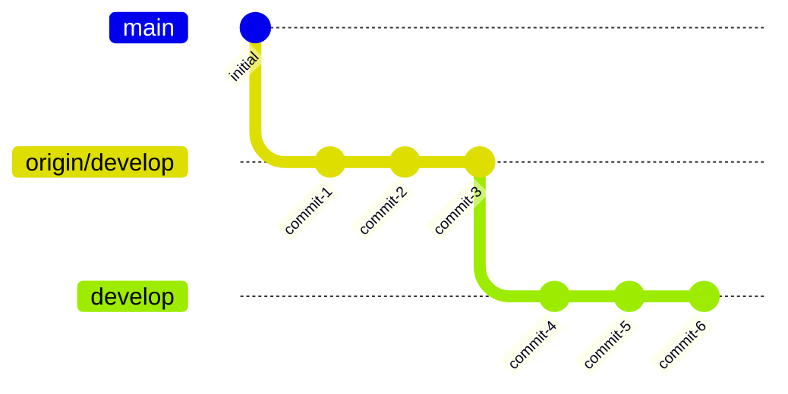
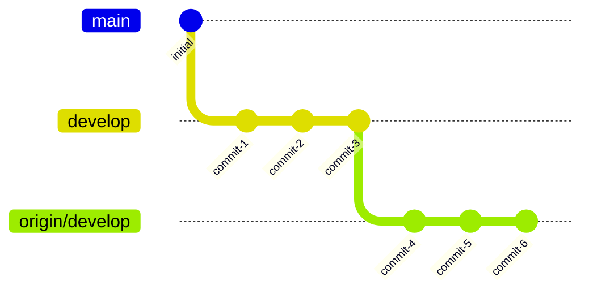
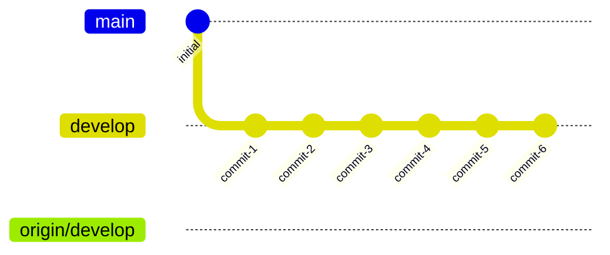

## 特定のバージョンから警告が出るようになっている

Git 2.27.0以降で`git pull`コマンドを実行すると警告が表示される。

```sh
warning: Pulling without specifying how to reconcile divergent branches is
discouraged. You can squelch this message by running one of the following
commands sometime before your next pull:

  git config pull.rebase false  # merge (the default strategy)
  git config pull.rebase true   # rebase
  git config pull.ff only       # fast-forward only

You can replace "git config" with "git config --global" to set a default
preference for all repositories. You can also pass --rebase, --no-rebase,
or --ff-only on the command line to override the configured default per
invocation.
```

メッセージにあるように3つのオプションのうち1つを選択しないと警告が表示され続ける。

## リベースせずマージする

```sh
git config pull.rebase false
```

デフォルトの挙動で、リベースを行わず、分岐がある場合はマージコミットを作成する。



このコミット状況で`git pull`を実行すると、



になる。

## リベースしてマージする

```sh
git config pull.rebase true
```

ローカルの変更をリベースをしてマージコミットを作成しない。


このコミット状況で`git pull`を実行すると、



になる。

## ファストフォワードのみ許可する

```sh
git config pull.ff only
```

ローカルで変更されておらずファストフォワードのみでリモートの変更を取り込める場合のみプルできる。



このコミット状況で`git pull`を実行すると、



になる。`develop`ブランチは`origin/develop`と完全に同じ位置を指す。
