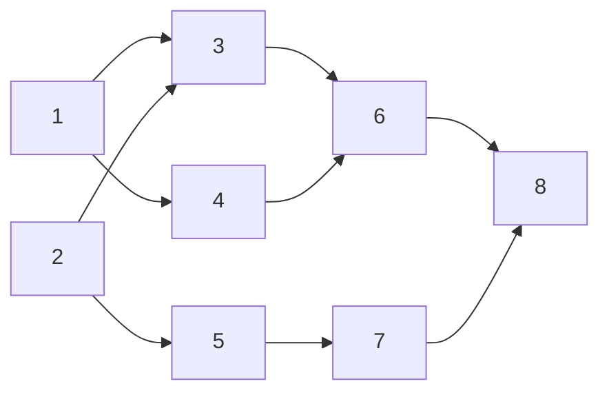

## トポロジカルソートを使用する

トポロジカルソート (`topological sort`) は、有向非巡回グラフ（DAG）の頂点を「すべての有向辺 $$u \to v$$ について $$u$$ が $$v$$ より前に来る」ように並べる手続きである。数値の大小で配列を並べ替える通常のソートとは対象が違い、辺が表す前後関係（依存・前提・制約）を壊さない線形順序を求める。

ビルドシステムやパッケージマネージャの依存解決、講義の履修順序、タスクのスケジューリングなど、「A のあとに B」という制約が集まった場面で使う。閉路があるとそのような順序は存在しないため、入力は DAG であることが前提になる（実装では処理しきれない頂点が残れば閉路ありと判定できる）。

本稿では Kahn のアルゴリズム（入次数 0 の頂点を順に確定していく幅優先寄りの手順）を説明する。深さ優先探索の帰りがけ順を逆に並べる方法でも同じ結果が得られる。

1.  **入次数の計算**: 各頂点 $$v$$ について、$$v$$ へ向かう辺の本数（入次数）を数える。
2.  **準備完了集合**: 入次数 0 の頂点をキュー（またはリスト）へ入れる。これらはいま確定してよい頂点である。
3.  **取り出し**: キューから頂点 $$u$$ を 1 つ取り、結果列の末尾へ追加する。
4.  **辺の削除**: $$u$$ から出る各辺 $$u \to v$$ について $$v$$ の入次数を 1 減らし、0 になった $$v$$ をキューへ追加する。
5.  **繰り返し**: キューが空になるまで手順 3〜4 を繰り返す。すべての頂点が結果に入ればトポロジカル順序が完成する。

```pseudocode
procedure topological_sort_kahn(V, E)
  for each v in V
    indegree[v] = 0
  for each edge (u → v) in E
    indegree[v] = indegree[v] + 1
  Q = empty queue
  for each v in V
    if indegree[v] = 0 then
      enqueue(Q, v)
  order = empty list
  while Q is not empty
    u = dequeue(Q)
    append u to order
    for each edge (u → v) in E
      indegree[v] = indegree[v] - 1
      if indegree[v] = 0 then
        enqueue(Q, v)
  if length(order) < length(V) then
    report cycle
  return order
```

各頂点と各辺を定数回しか触らないため、時間は $$O(V + E)$$、入次数表とキューに $$O(V)$$ の追加領域を使う。同じ入次数 0 の頂点が複数あるときの取り出し順で結果は変わりうるが、いずれも正当なトポロジカル順序である。依存関係に従う整列であり、同順位の相対順を保つ安定ソートではない。

次の DAG では辺 $$u \to v$$ が「$$u$$ を $$v$$ より前に置く」制約を表す。たとえば `1 → 3` と `2 → 3` があるので、`3` は `1` と `2` の両方より後ろになる。



下のデモは同じ手順を依存グラフで追う。矢印 $$u \to v$$ は「$$u$$ を $$v$$ より先に置く」、各頂点の下の数字はいまの入次数である。

黄色が入次数 0（いま取れる）、緑が処理中、紫が確定済み、オレンジはいま入次数を減らしている辺と先の頂点。下段の丸は確定順（トポロジカル順序）が左から埋まっていく様子を示す。シャッフルで別の DAG を作り直す。


<script>
window.DemoSort && DemoSort.boot('topological-sort-demo', function (root) {
  const FIXED = {
    verts: [1, 2, 3, 4, 5, 6, 7, 8],
    edges: [
      [1, 3],
      [1, 4],
      [2, 3],
      [2, 5],
      [3, 6],
      [4, 6],
      [5, 7],
      [6, 8],
      [7, 8],
    ],
  };

  function svgEl(name) {
    return document.createElementNS('http://www.w3.org/2000/svg', name);
  }

  function cloneIndeg(map) {
    const out = {};
    map.forEach(function (v, k) {
      out[k] = v;
    });
    return out;
  }

  function buildAdj(verts, edgeList) {
    const adj = new Map();
    verts.forEach(function (v) {
      adj.set(v, []);
    });
    edgeList.forEach(function (e) {
      adj.get(e[0]).push(e[1]);
    });
    return adj;
  }

  function buildInstance(useFixed) {
    if (useFixed) {
      return {
        verts: FIXED.verts.slice(),
        edgeList: FIXED.edges.map(function (e) {
          return e.slice();
        }),
        adj: buildAdj(FIXED.verts, FIXED.edges),
      };
    }

    const verts = DemoSort.shuffleCopy([1, 2, 3, 4, 5, 6]);
    const topo = DemoSort.shuffleCopy(verts);
    const edgeList = [];
    const seen = new Set();

    function addEdge(u, v) {
      const key = u + '>' + v;
      if (seen.has(key)) return;
      seen.add(key);
      edgeList.push([u, v]);
    }

    for (let i = 0; i < topo.length - 1; i++) {
      if (Math.random() < 0.7) addEdge(topo[i], topo[i + 1]);
    }
    for (let i = 0; i < topo.length; i++) {
      for (let j = i + 2; j < topo.length; j++) {
        if (Math.random() < 0.28) addEdge(topo[i], topo[j]);
      }
    }
    if (!edgeList.length && topo.length > 1) {
      addEdge(topo[0], topo[topo.length - 1]);
    }
    edgeList.sort(function (a, b) {
      if (a[0] !== b[0]) return a[0] - b[0];
      return a[1] - b[1];
    });
    return {
      verts: verts,
      edgeList: edgeList,
      adj: buildAdj(verts, edgeList),
    };
  }

  function layerOf(verts, edgeList) {
    const preds = new Map();
    verts.forEach(function (v) {
      preds.set(v, []);
    });
    edgeList.forEach(function (e) {
      preds.get(e[1]).push(e[0]);
    });
    const layer = new Map();
    function lay(v) {
      if (layer.has(v)) return layer.get(v);
      const ps = preds.get(v);
      let best = 0;
      for (let i = 0; i < ps.length; i++) {
        best = Math.max(best, lay(ps[i]) + 1);
      }
      layer.set(v, best);
      return best;
    }
    verts.forEach(lay);
    return layer;
  }

  function createGraphMount(demoRoot) {
    const panel = document.createElement('div');
    panel.className = 'sort-demo__topo-panel';

    const label = document.createElement('p');
    label.className = 'sort-demo__topo-label';
    label.textContent =
      '依存グラフ（矢印は「左の頂点を先に」。丸の下は入次数）';

    const canvas = document.createElement('div');
    canvas.className = 'sort-demo__topo-canvas';
    canvas.setAttribute('role', 'img');

    panel.appendChild(label);
    panel.appendChild(canvas);

    const bars = demoRoot.querySelector('.sort-demo__bars');
    if (bars && bars.parentNode) {
      bars.parentNode.insertBefore(panel, bars);
    } else {
      demoRoot.appendChild(panel);
    }
    return canvas;
  }

  function renderGraph(canvas, inst, state) {
    if (!canvas) return;
    const verts = inst.verts;
    const edgeList = inst.edgeList;
    const indeg = state.indeg || {};
    const sorted = new Set(state.sorted || []);
    const ready = new Set(state.ready || []);
    const active = state.active;
    const compare = state.compare;
    const activeEdge = state.activeEdge;
    const doneEdges = new Set(state.doneEdges || []);

    const layers = layerOf(verts, edgeList);
    const byLayer = new Map();
    let maxLayer = 0;
    verts.forEach(function (v) {
      const L = layers.get(v);
      maxLayer = Math.max(maxLayer, L);
      if (!byLayer.has(L)) byLayer.set(L, []);
      byLayer.get(L).push(v);
    });
    byLayer.forEach(function (list) {
      list.sort(function (a, b) {
        return a - b;
      });
    });

    const colW = 88;
    const rowH = 72;
    let maxRows = 1;
    byLayer.forEach(function (list) {
      maxRows = Math.max(maxRows, list.length);
    });
    const width = Math.max(280, (maxLayer + 1) * colW + 48);
    const height = Math.max(140, maxRows * rowH + 36);
    const positions = new Map();
    byLayer.forEach(function (list, L) {
      const startY = (height - list.length * rowH) / 2 + rowH / 2;
      list.forEach(function (v, i) {
        positions.set(v, {
          x: 32 + L * colW,
          y: startY + i * rowH,
        });
      });
    });

    canvas.innerHTML = '';
    const svg = svgEl('svg');
    svg.classList.add('sort-demo__topo-svg');
    svg.setAttribute('viewBox', '0 0 ' + width + ' ' + height);
    svg.setAttribute('width', String(width));
    svg.setAttribute('height', String(height));

    const defs = svgEl('defs');
    function makeMarker(id, fill) {
      const marker = svgEl('marker');
      marker.setAttribute('id', id);
      marker.setAttribute('viewBox', '0 0 10 10');
      marker.setAttribute('refX', '9');
      marker.setAttribute('refY', '5');
      marker.setAttribute('markerWidth', '7');
      marker.setAttribute('markerHeight', '7');
      marker.setAttribute('orient', 'auto-start-reverse');
      const tip = svgEl('path');
      tip.setAttribute('d', 'M 0 0 L 10 5 L 0 10 z');
      tip.setAttribute('fill', fill);
      marker.appendChild(tip);
      defs.appendChild(marker);
    }
    makeMarker('topo-arrow', '#7f8c8d');
    makeMarker('topo-arrow-active', '#e67e22');
    makeMarker('topo-arrow-done', '#bdc3c7');
    svg.appendChild(defs);

    edgeList.forEach(function (e) {
      const from = positions.get(e[0]);
      const to = positions.get(e[1]);
      if (!from || !to) return;
      const dx = to.x - from.x;
      const dy = to.y - from.y;
      const len = Math.sqrt(dx * dx + dy * dy) || 1;
      const ux = dx / len;
      const uy = dy / len;
      const r = 18;
      const line = svgEl('line');
      const key = e[0] + '>' + e[1];
      let cls = 'sort-demo__topo-edge';
      let markerUrl = 'url(#topo-arrow)';
      if (activeEdge && activeEdge[0] === e[0] && activeEdge[1] === e[1]) {
        cls += ' sort-demo__topo-edge--active';
        markerUrl = 'url(#topo-arrow-active)';
      } else if (doneEdges.has(key)) {
        cls += ' sort-demo__topo-edge--done';
        markerUrl = 'url(#topo-arrow-done)';
      }
      line.setAttribute('class', cls);
      line.setAttribute('marker-end', markerUrl);
      line.setAttribute('x1', String(from.x + ux * r));
      line.setAttribute('y1', String(from.y + uy * r));
      line.setAttribute('x2', String(to.x - ux * (r + 2)));
      line.setAttribute('y2', String(to.y - uy * (r + 2)));
      svg.appendChild(line);
    });

    verts.forEach(function (v) {
      const p = positions.get(v);
      const g = svgEl('g');
      let cls = 'sort-demo__topo-node';
      if (sorted.has(v)) cls += ' sort-demo__topo-node--sorted';
      else if (v === active) cls += ' sort-demo__topo-node--active';
      else if (v === compare) cls += ' sort-demo__topo-node--compare';
      else if (ready.has(v)) cls += ' sort-demo__topo-node--ready';
      g.setAttribute('class', cls);

      const c = svgEl('circle');
      c.setAttribute('cx', String(p.x));
      c.setAttribute('cy', String(p.y));
      c.setAttribute('r', '17');

      const t = svgEl('text');
      t.setAttribute('x', String(p.x));
      t.setAttribute('y', String(p.y));
      t.setAttribute('text-anchor', 'middle');
      t.setAttribute('dy', '.35em');
      t.textContent = String(v);

      const d = svgEl('text');
      d.setAttribute('class', 'sort-demo__topo-indeg');
      d.setAttribute('x', String(p.x));
      d.setAttribute('y', String(p.y + 30));
      d.setAttribute('text-anchor', 'middle');
      d.textContent = '入次 ' + (indeg[v] != null ? indeg[v] : 0);

      g.appendChild(c);
      g.appendChild(t);
      g.appendChild(d);
      svg.appendChild(g);
    });

    const readyText = state.ready && state.ready.length
      ? state.ready.join('、')
      : 'なし';
    canvas.setAttribute(
      'aria-label',
      '依存グラフ。キュー（入次数0）は ' + readyText + '。'
    );
    canvas.appendChild(svg);
  }

  function mountOrder(container, order, barClass) {
    container.innerHTML = '';
    if (!order.length) {
      container.removeAttribute('role');
      container.removeAttribute('aria-label');
      return;
    }
    container.setAttribute('role', 'list');
    container.setAttribute('aria-label', '確定したトポロジカル順序');
    order.forEach(function (v, i) {
      const chip = document.createElement('div');
      chip.className = barClass;
      chip.style.height = '36px';
      chip.setAttribute('title', String(v));
      chip.setAttribute('role', 'listitem');
      chip.setAttribute(
        'aria-label',
        DemoSort.barAccessibilityLabel(i, String(v), 'sorted')
      );
      chip.setAttribute('data-role', 'sorted');
      container.appendChild(chip);
    });
  }

  function generateSteps(inst) {
    const verts = inst.verts;
    const steps = [];
    const indeg = new Map();
    verts.forEach(function (v) {
      indeg.set(v, 0);
    });
    inst.edgeList.forEach(function (e) {
      indeg.set(e[1], indeg.get(e[1]) + 1);
    });

    const queue = [];
    verts
      .slice()
      .sort(function (a, b) {
        return a - b;
      })
      .forEach(function (v) {
        if (indeg.get(v) === 0) queue.push(v);
      });

    const order = [];
    const doneEdges = [];

    steps.push({
      kind: 'init',
      order: [],
      indeg: cloneIndeg(indeg),
      ready: queue.slice(),
      doneEdges: [],
    });

    while (queue.length > 0) {
      const u = queue.shift();
      steps.push({
        kind: 'pick',
        order: order.slice(),
        u: u,
        indeg: cloneIndeg(indeg),
        ready: queue.slice(),
        active: u,
        doneEdges: doneEdges.slice(),
      });

      order.push(u);
      steps.push({
        kind: 'placed',
        order: order.slice(),
        u: u,
        indeg: cloneIndeg(indeg),
        ready: queue.slice(),
        active: u,
        doneEdges: doneEdges.slice(),
      });

      const succs = (inst.adj.get(u) || []).slice().sort(function (a, b) {
        return a - b;
      });
      for (let s = 0; s < succs.length; s++) {
        const v = succs[s];
        indeg.set(v, indeg.get(v) - 1);
        doneEdges.push(u + '>' + v);
        const becameReady = indeg.get(v) === 0;
        if (becameReady) queue.push(v);
        steps.push({
          kind: 'relax',
          order: order.slice(),
          u: u,
          v: v,
          indeg: cloneIndeg(indeg),
          ready: queue.slice(),
          active: u,
          compare: v,
          activeEdge: [u, v],
          becameReady: becameReady,
          doneEdges: doneEdges.slice(),
        });
      }
    }

    steps.push({
      kind: 'done',
      order: order.slice(),
      indeg: cloneIndeg(indeg),
      ready: [],
      doneEdges: doneEdges.slice(),
    });
    return steps;
  }

  function paint(api, canvas, inst, s, caption) {
    renderGraph(canvas, inst, {
      indeg: s.indeg,
      sorted: s.order,
      ready: s.ready,
      active: s.active,
      compare: s.compare,
      activeEdge: s.activeEdge,
      doneEdges: s.doneEdges,
    });
    mountOrder(api.barsEl, s.order, 'sort-demo__bar');
    api.setCaption(caption);
  }

  const graphCanvas = createGraphMount(root);
  let currentInst = null;
  let usedFixedOnce = false;

  const initialCaption =
    'Kahn 法のデモ（黄=取れる、緑=処理中、紫=確定、橙=入次数を減らす辺）';

  DemoSort.attachPlayback({
    root: root,
    dataAttr: 'data-topo',
    initialValues: FIXED.verts.slice(),
    initialCaption: initialCaption,
    barClass: 'sort-demo__bar',
    rebuild: function (api) {
      const useFixed = !usedFixedOnce;
      usedFixedOnce = true;
      currentInst = buildInstance(useFixed);
      api.values = currentInst.verts.slice();
      api.steps = generateSteps(currentInst);
      const first = api.steps[0];
      // 初期表示は steps[0] 済みなので、最初の操作は次のステップから
      api.idx = api.steps.length > 1 ? 1 : 0;
      paint(
        api,
        graphCanvas,
        currentInst,
        first,
        initialCaption +
          '。まずは入次数 0 の頂点（黄）だけが取れる'
      );
    },
    applyStep: async function (api, s) {
      if (!currentInst) return;
      if (s.kind === 'init') {
        paint(
          api,
          graphCanvas,
          currentInst,
          s,
          '初期状態。入次数 0 の頂点 ' +
            (s.ready.length ? s.ready.join('、') : 'なし') +
            ' をキューへ'
        );
        return;
      }
      if (s.kind === 'pick') {
        paint(
          api,
          graphCanvas,
          currentInst,
          s,
          'キューから頂点 ' + s.u + ' を取り出す（いま依存が残っていない）'
        );
        return;
      }
      if (s.kind === 'placed') {
        paint(
          api,
          graphCanvas,
          currentInst,
          s,
          '頂点 ' +
            s.u +
            ' を確定順へ追加 → ' +
            s.order.join(' → ')
        );
        return;
      }
      if (s.kind === 'relax') {
        let msg =
          '辺 ' +
          s.u +
          '→' +
          s.v +
          ' を外し、' +
          s.v +
          ' の入次数を ' +
          s.indeg[s.v] +
          ' にする';
        if (s.becameReady) {
          msg += '（0 になったのでキューへ）';
        }
        paint(api, graphCanvas, currentInst, s, msg);
        return;
      }
      if (s.kind === 'done') {
        paint(
          api,
          graphCanvas,
          currentInst,
          s,
          '完了。トポロジカル順序: ' + s.order.join(' → ')
        );
      }
    },
    stepPauseMs: 420,
  });
});
</script>




## 類似アルゴリズムとの相違点

[選択ソート](/2026/05/11/sort-selection.html)は未整列範囲から最小キーを選んで確定位置へ運ぶ。Kahn 法も「いま選んでよい要素」を 1 つずつ確定位置へ運ぶ点は似ているが、選び方の基準がキーの大小ではなく入次数（依存の解消）である。

通常の比較ソート（[マージソート](/2026/05/03/sort-merge.html)や[ヒープソート](/2026/05/04/sort-heap.html)など）は全順序なキー比較を前提にする。トポロジカルソートは辺が与える半順序だけを守り、比較不能な頂点どうしの前後はキューの取り出し順などに委ねる。

深さ優先探索で各頂点の「帰りがけ時刻」を記録し、時刻の降順に並べる方法も同じ DAG に対するトポロジカル順序を返す。Kahn 法は入次数とキューで幅優先に進め、閉路検出も「残頂点の有無」で分かりやすい。
